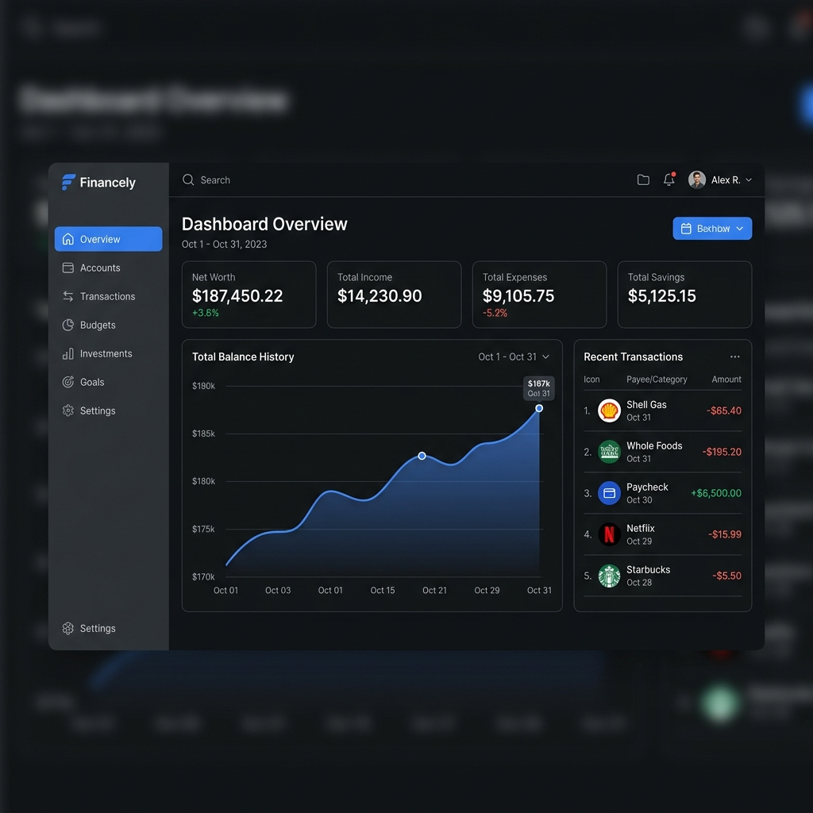

# FluxBudget 💸

> A state-of-the-art, beautifully designed personal finance tracker built with Electron and React.



## 🌟 Features

- **Premium Monochromatic UI:** Stunning aesthetic featuring fluid animations, sharp contrast, and a sleek modern palette.
- **Full Dashboard Analytics:** Visualize your income, expenses, and bucket-based budgets with interactive Recharts.
- **Smart Transactions:** Fast, sortable, and searchable ledger for all your financial activity.
- **Bucketing System:** Budget your life using categories tied to Needs, Wants, and Savings.
- **CSV Import/Export:** Easily migrate your data from old Excel trackers or export it for your own backups.
- **Dark & Light Mode:** Fully responsive dual-theme support that remembers your preference.
- **Offline First:** All your financial data is securely stored locally in a lightweight JSON database. No cloud, no subscription fees.

## 🚀 Tech Stack

- **Frontend:** React 18, Tailwind CSS v4, Framer Motion, Recharts, Lucide Icons
- **Backend/Desktop wrapper:** Electron (IPC Architecture)
- **Tooling:** Vite, TypeScript

## 📦 Installation & Setup

If you want to run this project locally for development:

1. Clone the repository:
   ```bash
   git clone https://github.com/yourusername/FluxBudget.git
   cd FluxBudget
   ```
2. Install dependencies:
   ```bash
   npm install
   ```
3. Start the development server (with hot-reload for React and Electron):
   ```bash
   npm run dev
   ```

## 🔨 Build for Production

To compile a standalone Windows executable (`.exe`) installer:

```bash
npm run dist
```
The final installer will be available in the `release/` folder.

## 🤝 Contributing

Contributions, issues, and feature requests are welcome!

## 📝 License

This project is [MIT](https://choosealicense.com/licenses/mit/) licensed.
